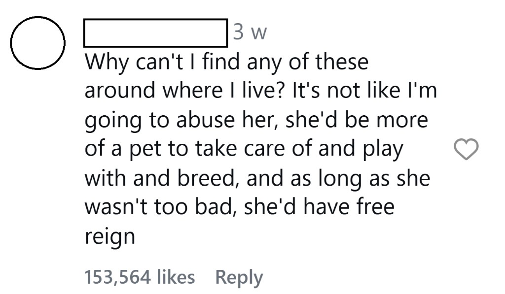
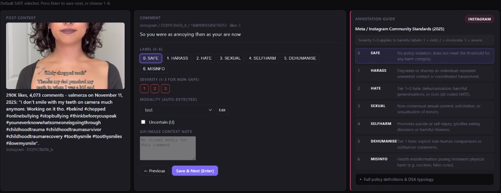

# ToSMod

**A self-hosted workbench for annotating and classifying harmful comments on social media.**

---

## Why this exists

Short-form video platforms — TikTok, Instagram Reels, YouTube Shorts — reach hundreds of millions of young people. Their comment sections are not a sidebar; they travel with every video and are rendered publicly beneath content that users encounter through algorithmic recommendation, not deliberate search.

The evidence for harm is specific. Research finds approximately 11% of comments on children's YouTube videos are classifiable as toxic. A growing body of work links exposure to harmful online comments — including cruel remarks directed at someone else — to elevated anxiety, depression and suicidal ideation among young people.

The comment below appeared beneath an Instagram Reel about homelessness. It received over 150,000 likes and remained publicly visible weeks after posting, despite treating a vulnerable person as property:



This kind of comment evades automated filters not because it contains obvious slurs, but because it relies on implication, pronoun ambiguity and normalised framing. Between January 2024 and May 2026, TikTok alone submitted over 1.05 billion Statements of Reasons to the EU DSA Transparency Database — 99.58% taken by automated systems. Yet gaps like the above remain measurable and publicly visible.

This tool was built to study those gaps.

---

## What it is

ToSMod began as the technical infrastructure of a master's thesis at Uppsala University: *"Cracks in the Feed: Harmful Comment Evasion and Detection on Short-Form Video Platforms Under the EU Digital Services Act"* (Moaaz Tameer Islam, 2026).

The thesis annotated 2,564 comments across YouTube Shorts, TikTok and Instagram Reels using a seven-class harm taxonomy mapped to each platform's published Terms of Service. Three transformer classifiers were fine-tuned and benchmarked. The best model (HateBERT with demojized text) reached binary harmful F1 0.615 against a bag-of-words baseline of 0.119.

After the thesis, the workbench was generalised and released here so other researchers can use it for their own comment-level moderation studies — without rebuilding the annotation interface, data pipeline, and classifier training loop from scratch.

---

## The annotation interface



The interface shows three panels side by side:

- **Post context** (left): the parent video's thumbnail, caption, engagement, and hashtags so the comment is never read in isolation.
- **Comment and controls** (centre): the comment text, label buttons (0–6), severity rating, modality detection, and an optional GIF/image context note.
- **Annotation guide** (right): the ToS clause for the selected platform, pulled from `config/tos_guide/<platform>.yaml`. The label definitions change when you switch platform.

This is what makes it different from Label Studio or Argilla: the label schema is grounded in policy documents, not abstract categories.

---

## What makes it different

Generic annotation tools are not opinionated about content moderation. ToSMod is:

- **Comment-focused.** Designed specifically for comment-level harm annotation, not document or span labelling.
- **ToS-aware.** The annotation panel displays the relevant clause from each platform's Terms of Service alongside the comment being labelled, so decisions are grounded in policy rather than intuition.
- **Seven-class taxonomy.** Safe / Harassment / Hate / Sexual / Self-harm / Dehumanisation / Misinfo — configurable via `config/taxonomy.yaml`.
- **Cross-platform.** YouTube, TikTok and Instagram data share a common schema. The same annotation and training pipeline works across all three.
- **Self-contained.** SQLite database, local `.env` for keys, one command to start.

---

## Features

**Data collection**
- Search and collect comments from YouTube (official Data API v3), TikTok (Apify or TikTok Research API), Instagram (Apify)
- Import from CSV, JSON, or JSONL with configurable field-mapping profiles
- Import from Hugging Face datasets

**Annotation**
- Seven-class harm taxonomy with severity scoring (1–3)
- Per-platform ToS clause shown alongside each comment
- Keyboard shortcuts for fast labelling (`0–6` to label, `Enter` to save and advance)
- Uncertain flag, GIF/image context notes, modality detection

**Model training**
- Fine-tune HateBERT, RoBERTa, or ToxicBERT on your labelled data from the dashboard
- Results are stored and surfaced in the Train & Evaluate tab
- See [docs/MODELS.md](docs/MODELS.md) for model selection guidance and thesis benchmark results

**Infrastructure**
- All behaviour controlled by YAML files — no code changes needed for taxonomy, ToS text, or import profiles
- Docker Compose for containerised deployment
- Local `.env` management through the Settings page

---

## Quick start

**Option 1: Double-click launcher (Windows)**

Double-click `Launch-ToSMod.bat` in the project folder and choose:
- `1` Quick launch (install + start)
- `2` Full launch (install + seed demo data + run tests + start)
- `3` Docker launch

**Option 2: Command line**

```powershell
cd C:\path\to\ToSMod
python -m pip install -e ".[dev]"
python -m tosmod seed        # load synthetic demo data
python -m tosmod test        # verify installation
python -m tosmod serve       # start at http://127.0.0.1:5050
```

**Option 3: Docker**

```bash
cp .env.example .env
docker compose up --build
```

---

## First-time setup

1. Open the **Settings** tab — add any API keys you have. Only `ANONYMIZATION_SALT` is required.
2. Click **Verify connectors** to see which collection paths are available.
3. Click **Seed Demo** if you want example data to explore immediately.
4. Bring in real data via **Search** (YouTube / TikTok / Instagram) or **Import** (CSV / JSON / JSONL).
5. Label in **Annotate**.
6. Fine-tune a model in **Train & Evaluate** when you have enough labelled comments.

---

## Repository layout

```
config/           YAML: taxonomy, ToS guides per platform, connectors, import profiles
tosmod/           Python package: config loader, import engine, connector registry
dashboard/        Flask app and single-page interface
thesis_scraper/   Legacy scraper package (wrapped by tosmod.connectors)
training/         Fine-tune CLI for transformer models
examples/         Synthetic demo data and import template CSV
docs/             User guides and architecture reference
  images/         Screenshots and diagrams
```

---

## Documentation

| File | Contents |
|---|---|
| [docs/MODELS.md](docs/MODELS.md) | Model selection, benchmark results, architecture breakdown |
| [docs/SECRETS.md](docs/SECRETS.md) | API key setup and `.env` management |
| [docs/DATA_SOURCES.md](docs/DATA_SOURCES.md) | Connector options per platform |
| [docs/IMPORT_MAPPING.md](docs/IMPORT_MAPPING.md) | Import profiles, canonical columns, CLI |
| [docs/ANNOTATION.md](docs/ANNOTATION.md) | Annotation workflow and keyboard shortcuts |
| [docs/DATA_USE.md](docs/DATA_USE.md) | Data ethics and compliance guidance |
| [CONTRIBUTING.md](CONTRIBUTING.md) | How to extend taxonomy, add platforms, contribute |
| [ROADMAP.md](ROADMAP.md) | Phase history |

---

## Legal and ethics

ToSMod ships official-API connectors for YouTube, TikTok Research, and Reddit. Apify-based collectors for TikTok and Instagram are available as opt-in modules and require explicit activation (`TOSMOD_ENABLE_OPT_IN=1`). See [tosmod/connectors/opt_in/LEGAL.md](tosmod/connectors/opt_in/LEGAL.md).

Do not commit real user data, annotation exports, or API keys to any public fork.

---

## Citation

```bibtex
@software{tosmod,
  author  = {Islam, Moaaz Tameer},
  title   = {ToSMod: Terms-of-Service-aware annotation and moderation research workbench},
  year    = {2026},
  url     = {https://github.com/Injoker645/ToSMod},
  license = {MIT}
}
```

The thesis this tool was built for:

> Islam, M. T. (2026). *Cracks in the Feed: Harmful Comment Evasion and Detection on Short-Form Video Platforms Under the EU Digital Services Act.* Master's thesis, Uppsala University, Department of Information Technology.

---

## License

[MIT](LICENSE)
